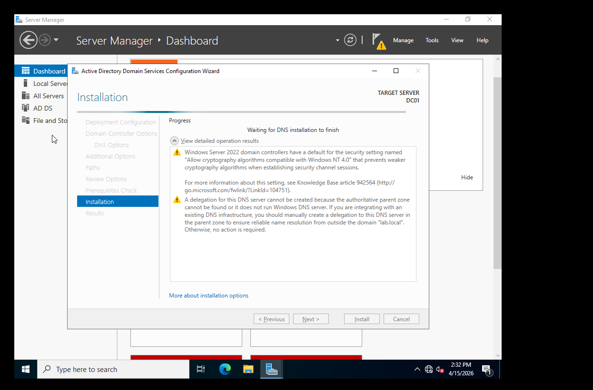
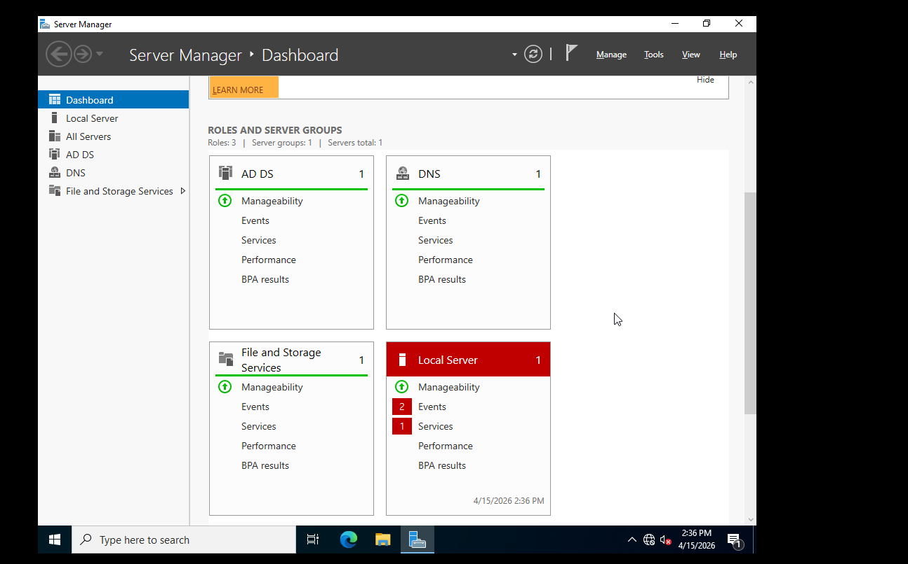

# Phase 2 – Domain Setup

## Objective
Configure Windows Server 2022 as a Domain Controller with Active Directory.

## Steps

### Static IP Configuration
- Set IP to 192.168.100.10 /255.255.255.0
- DNS set to same IP (self)

### Server Rename
- Renamed server to DC01

### AD DS Installation
- Installed Active Directory Domain Services role

### Domain Controller Promotion
- Created new forest: lab.local
- Set DSRM password

## Outcome
- Server is now a Domain Controller for lab.local
- Active Directory Users and Computers is available

## Screenshots

