# Phase 3 – Windows 11 Client Setup

## Objective
Install Windows 11 and join it to the `lab.local` domain.

## Steps

### 1. VM Creation
- Created new VM in VMware Workstation
- Used Custom configuration
- Disabled Easy Install to manually control installation
- Attached Windows 11 ISO manually

### 2. Issue – EFI Network Timeout
- VM attempted to boot from network (PXE) instead of ISO
- Same issue as Phase 1

### 3. Fix – Boot Menu
- Powered on VM, pressed ESC repeatedly
- Selected "CD/DVD Drive" from boot menu
- Successfully booted into Windows 11 installer

### 4. Windows 11 Installation
- Selected "I don't have a product key"
- Chose Windows 11 Pro
- Selected "Custom: Install Windows only"

### 5. Issue – Network Requirement Screen
- Windows 11 required internet connection to continue
- Lab uses Host-Only network (no internet by design)

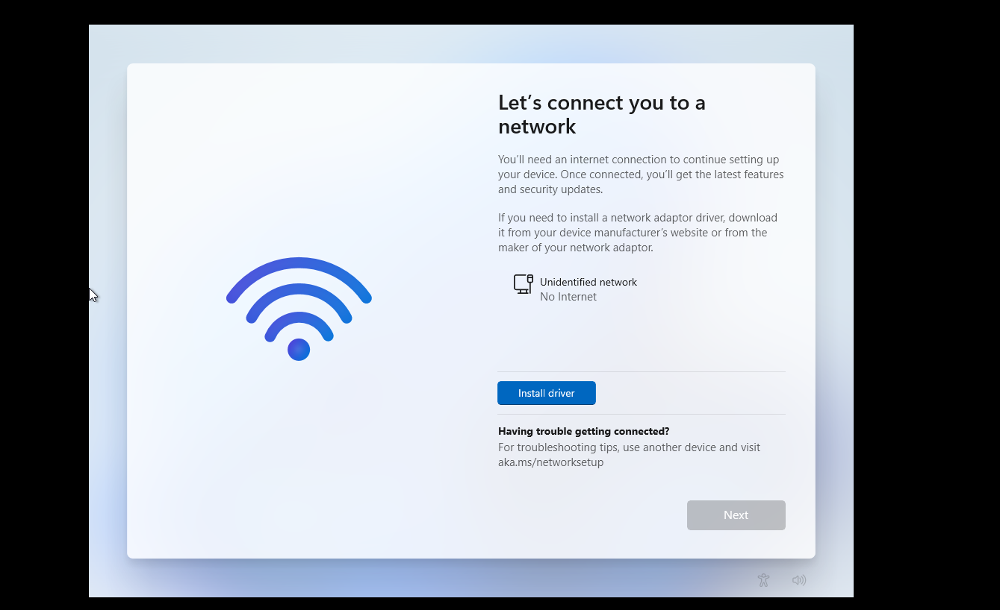

### 6. Fix – Bypass Network Requirement
- Pressed Shift + F10 to open command prompt
- Typed `regedit` to open Registry Editor
- Navigated to `HKEY_LOCAL_MACHINE\SOFTWARE\Microsoft\Windows\CurrentVersion\OOBE`
- Created new DWORD (32-bit): `BypassNRO` with value `1`
- Closed Registry Editor and Command Prompt
- Clicked back arrow, then Next – "I don't have internet" button appeared
- Created local account: `client1`

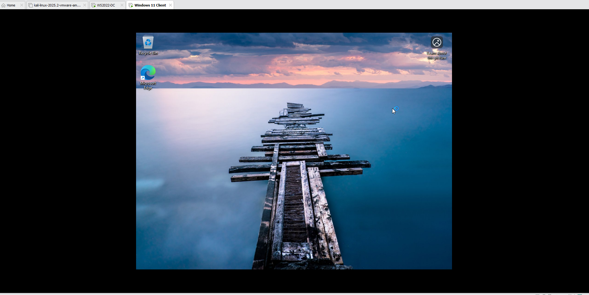

### 7. Network Configuration (Static IP)
- After reaching desktop, set static IP:
  - IP: `192.168.100.20`
  - Subnet: `255.255.255.0`
  - Gateway: (blank)
  - DNS: `192.168.100.10`

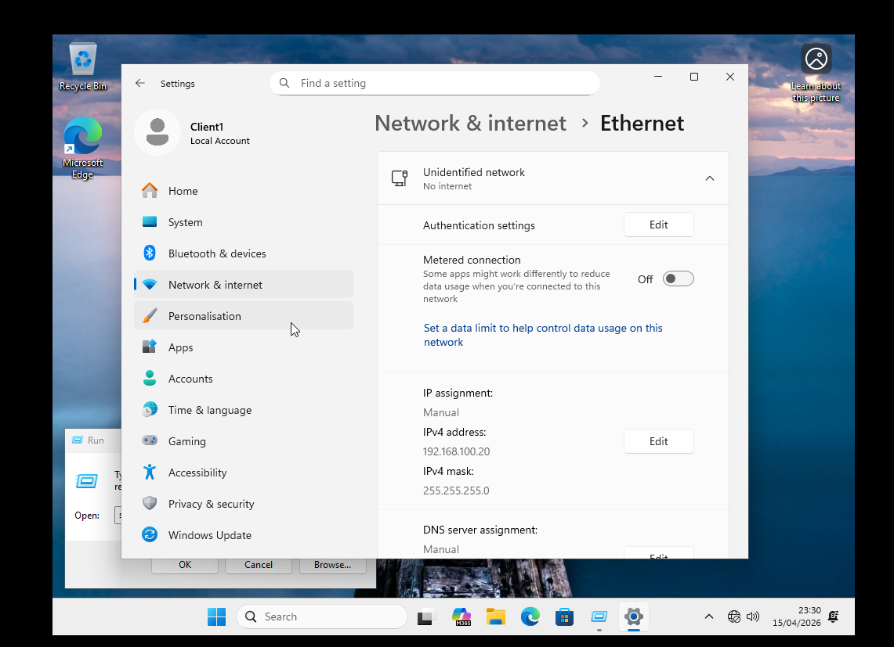

### 8. Issue – Could Not Contact Domain Controller
- Error when trying to join `lab.local`

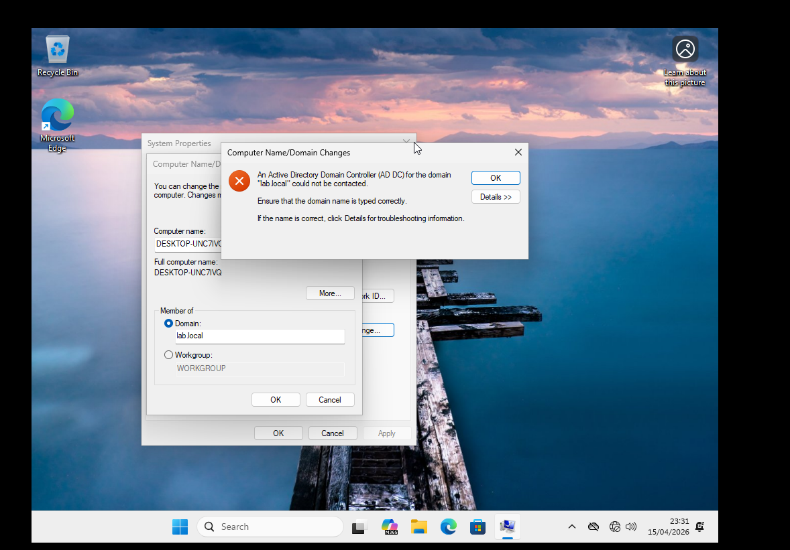
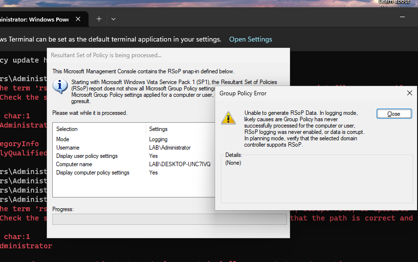

### 9. Fix – VMware Network Adapter Mismatch
- Discovered Server was on NAT, Client on Host-Only
- Powered off both VMs
- Changed Server's network adapter to Host-Only
- Powered on Server first, then Client
- Verified Server IP: `192.168.100.10`
- Verified Client IP: `192.168.100.20`
- Ping test successful

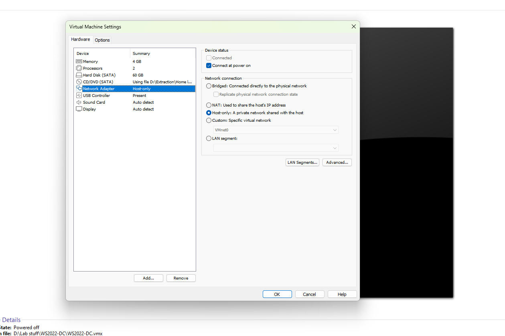

### 10. Domain Join
- Pressed Win+R, typed `sysdm.cpl`
- Computer Name tab → Change
- Selected Domain: `lab.local`
- Credentials: `lab\Administrator`
- Restarted when prompted

### 11. Verification
- Logged in as `lab\Administrator`
- Opened Command Prompt
- `whoami` → `lab\administrator`
- `nslookup lab.local` → resolved to `192.168.100.10`

## Outcome
- Windows 11 successfully joined to `lab.local` domain
- Domain authentication working
- Client can resolve domain controller via DNS

## Screenshots
*(Add your screenshots here with proper paths)*

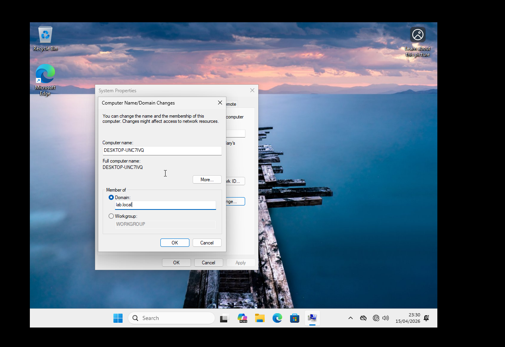

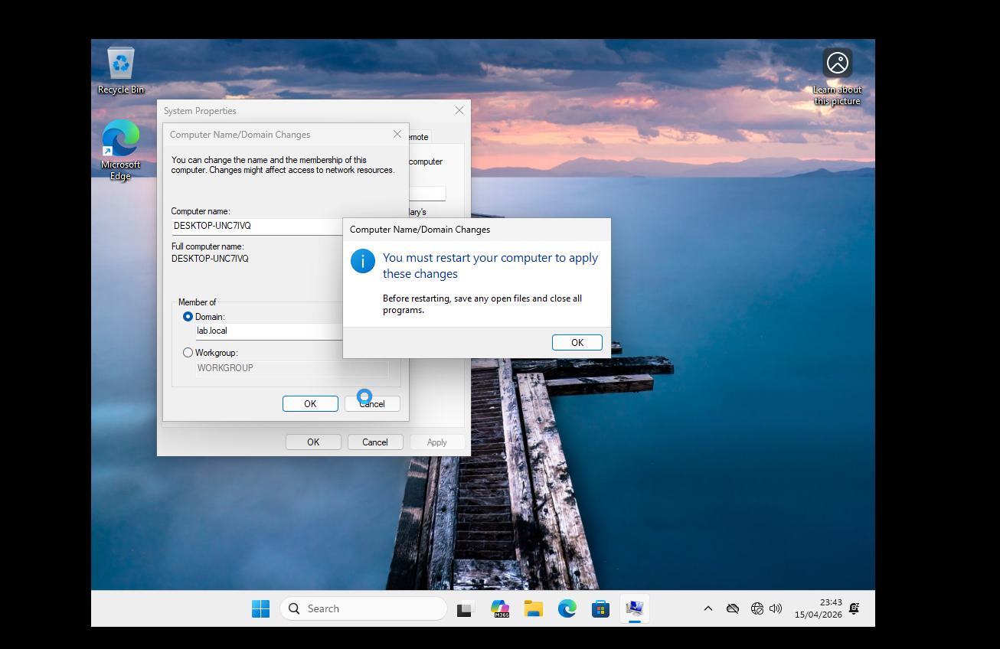

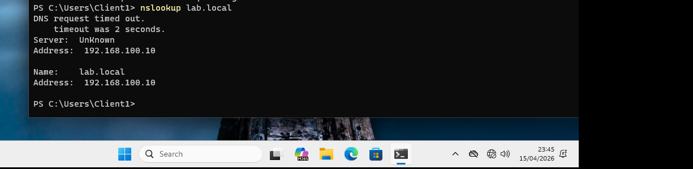
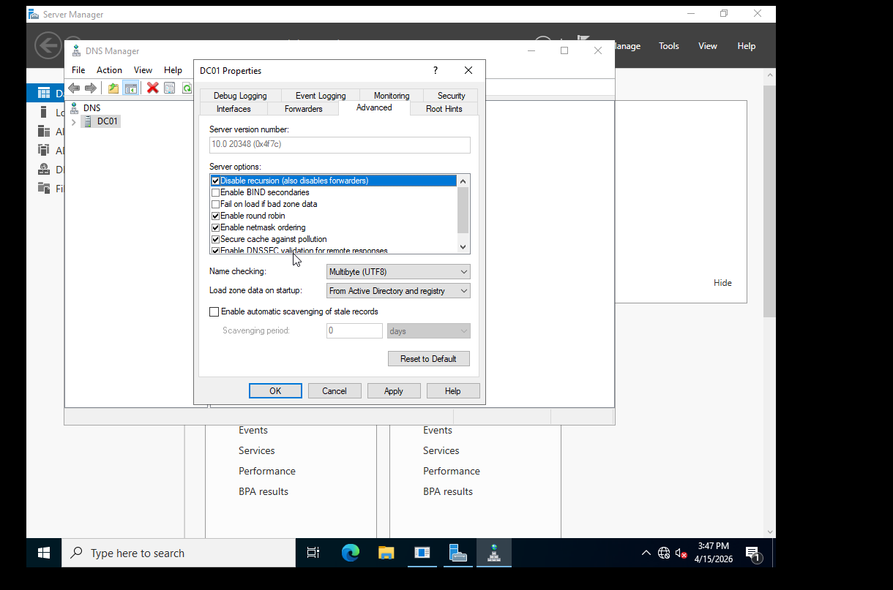
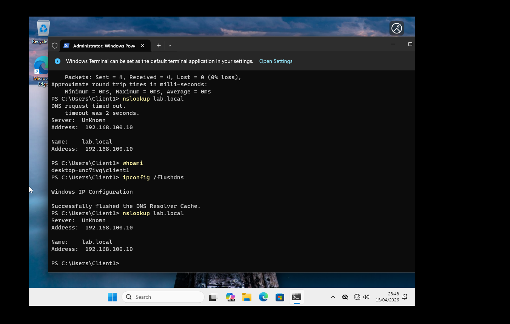

## Issues Encountered & Lessons Learned
| Issue | Solution |
|-------|----------|
| EFI network timeout | Boot menu → select CD/DVD |
| Windows 11 requires internet | BypassNRO registry key |
| Domain controller unreachable | Both VMs must be on same Host-Only network |
| DNS timeout after fix | Flushed DNS cache with `ipconfig /flushdns` |

## Tools Used
- VMware Workstation
- Windows 11 ISO (Evaluation)
- Registry Editor
- Command Prompt / PowerShell
