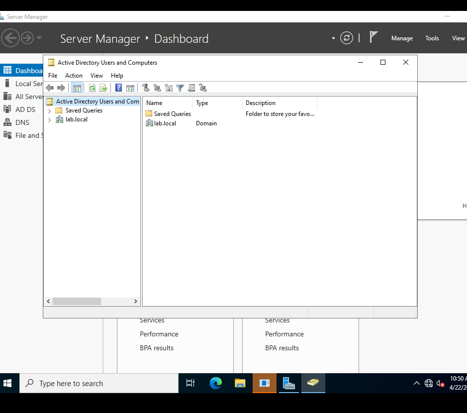
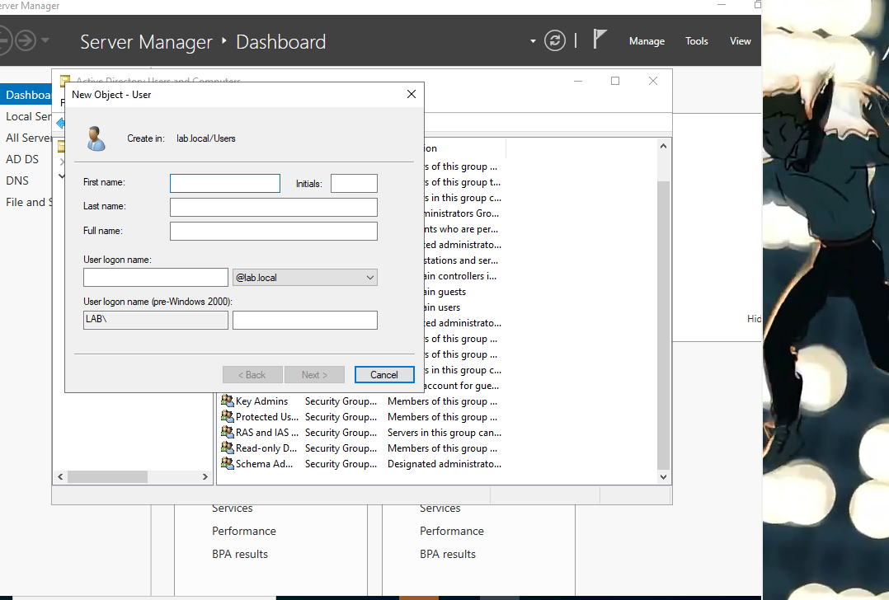
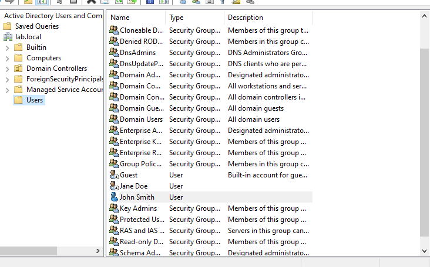
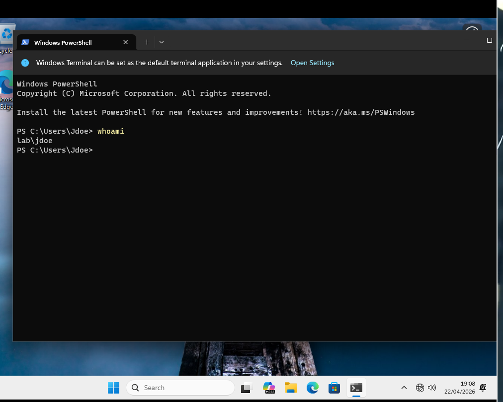

# Phase 4 – User Management

## Objective
Create standard domain users in Active Directory and verify they can log into the domain-joined Windows 11 client.

## Steps

### 1. Create Users in Active Directory
- Opened **Active Directory Users and Computers** on the Domain Controller (`DC01`)
- Navigated to `lab.local` → **Users**
- Created two new users:

  ### Creating a user in ADUC

| Username | Full Name | Password |
|----------|-----------|----------|
| `jdoe`   | Jane Doe  | `Donkey123` |
| `jsmith` | John Smith| `P@ssw0rd123` |

### Creating a user in ADUC

- **Note:** Initially the account was disabled by mistake; fixed by enabling it in ADUC.

### 2. Test Login on Windows 11 Client
- On the Windows 11 VM, signed out of any existing session
- Clicked **Other user**
- Entered `lab\jdoe` and password
- Successfully logged in

### 3. Verify Domain Authentication
- Opened Command Prompt
- Ran `whoami` → output: `lab\jdoe`

## Outcome
- Domain users can successfully authenticate to the domain-joined Windows 11 client
- Standard users have no administrative privileges (by default)

## Issues Encountered

| Issue | Solution |
|-------|----------|
| Account disabled after creation | Enabled the account in ADUC (right-click → Enable Account) |
| "Username or password incorrect" | Reset password and ensured "User must change password at next logon" was unchecked |

## Tools Used
- Active Directory Users and Computers
- Windows 11 login screen
- Command Prompt

## Lessons Learned
- New AD user accounts can be created as disabled by default if the checkbox is missed during creation
- Always verify account status before attempting login
- Domain login requires either `DOMAIN\username` or `username@domain.local` format unless the domain is already recognised.
