# Siem Integration

## Objective 🎯

 - The objective of this phase is to integrate a SIEM (Wazuh) by adding a Wazuh VM to my VMware Workstation lab
 - Install an Agent on my Windows 11 VM
 - Configure log aggregation

## Status: In progress 🚧
- Installed Wazuh VM
- Managed to access the dashboard
- Installed the agent on the Windows 11 VM
- Configure a failed logon alert (In progress)
- Simulate a brute force attack (Planned)
- Documenting the alert (Planned)
- Incident report (Planned)

### SIEM Installation ⚙️

- Downloaded Wazuh from the official source and then imported it to my VMware Workstation
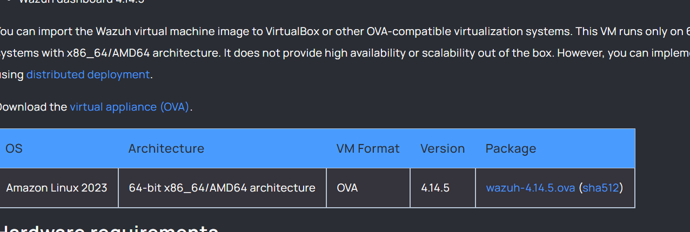
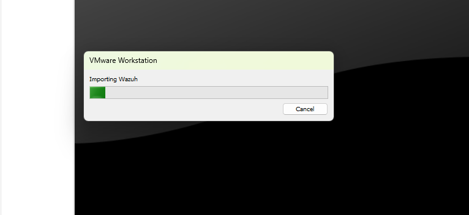

- Installed Wazuh Successfully, logged in and then checked to make sure it was connected to my virtual network
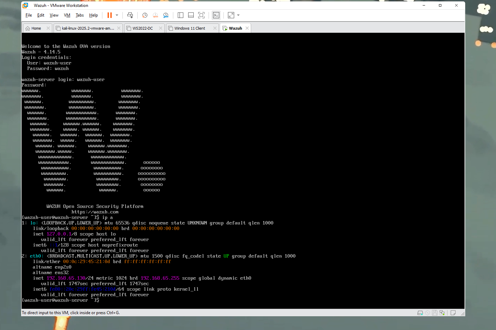

- Next I visited the Ip address on my main computer to access the Wazuh dashboard
  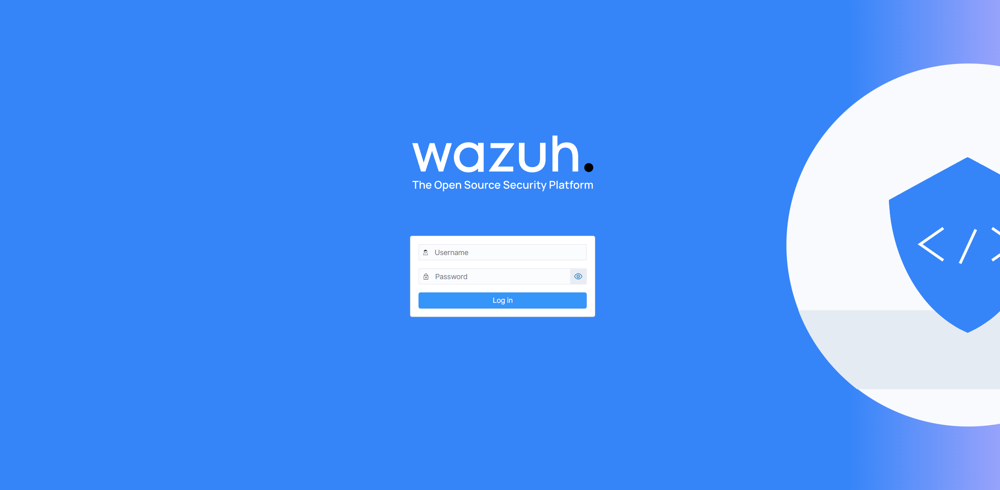
  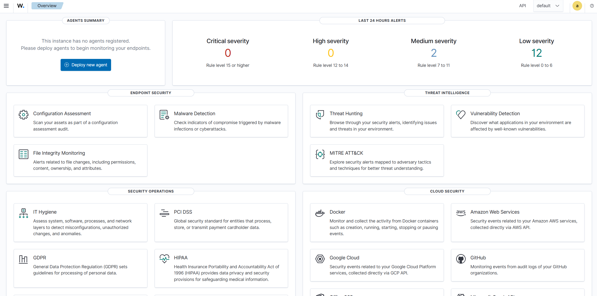
  - As you can see here I got to the dashboard and I already have a bunch of alerts lol

### Installing the Agent on the Windows 11 🪟

- Started deploying a new agent and filled out the data and obtained the command I needed to install it on my windows 11 VM
  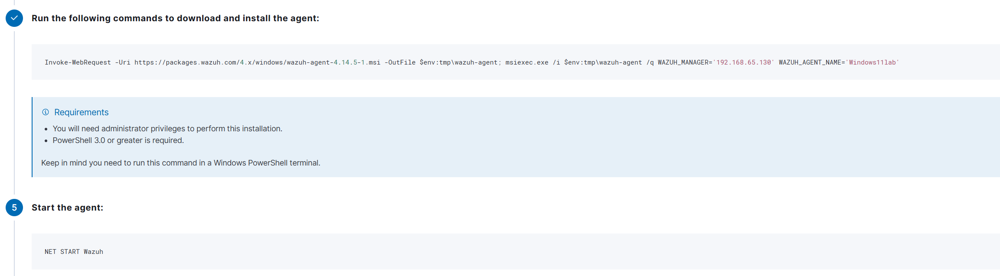

- Next logon to my Windows 11 VM, start up powershell with adminstrator privelleges and run the commands.
- Sadly could't copy and paste it so im going to have to type it in by hand 🥲.
- Of course it is't working, probably typed it wrong :/
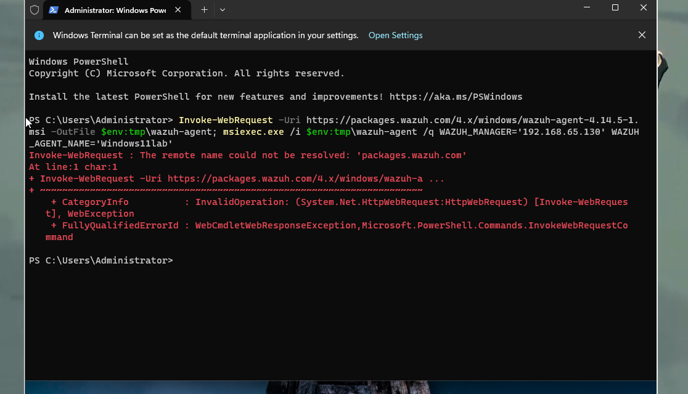

### Problem 1: Command not working. 😤

- Going to try typing it out again to see if that works, maybe I typed it in wrong or something.
- Retyping it in did not work so I am going to try fixing my VM and making it let me copy and paste from my main pc over to it

#### Trying to fix it 🛠️
- Should be easy enough, going to start by googling how to make it so I can copy and paste from my main computer into a Virtual machine on my VMware Workstation.
- Google says to navigate to VM> VMware Tool installation
- Followed through the instructions and completed the install on the VM.
- Restarted the VM
- Problem solved, can paste into the VM now
  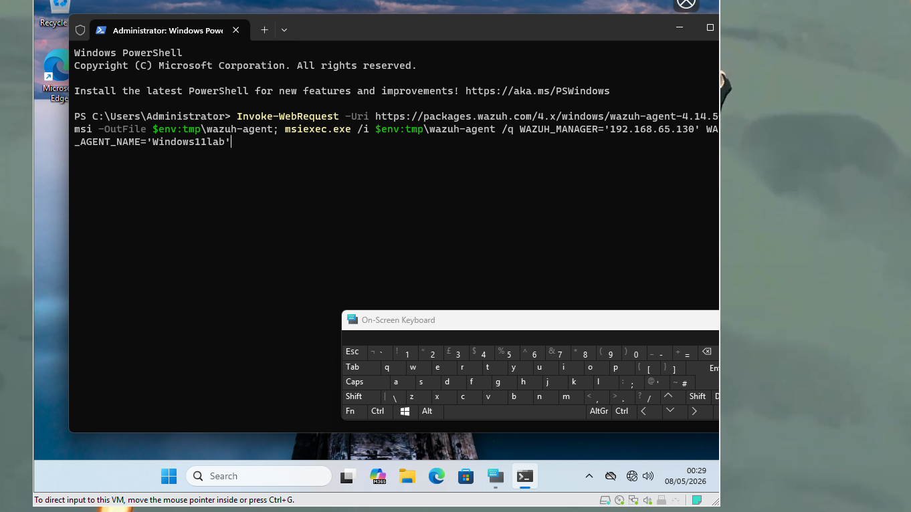
- It did not fix it, seems the problem was something else entirely 😤.
- After some research, this output means that it is unable to connect to the internet to actually download the file
- There are 2 ways I can go about this: Either connect the VM to the internet or manually download the file on my main PC and just move it over.
- Before doing this, Im going to turn on my Domain Controller to see if that fixes anything
- Obviously that didn't do anything
- Ran ping commands to 8.8.8.8 and google.com to confirm if it was a connectivity issue
- It is indeed the fact that the VM is not connected to the internet.

#### Solution:
- I am going to move forward with the option of connecting this Vm to the internet as connecting it to the internet will be useful in future projects.
- What I am going to do is add a second network adapter and change that to NAT so the windows 11 VM stays in the domain but can also connect to the internet.
  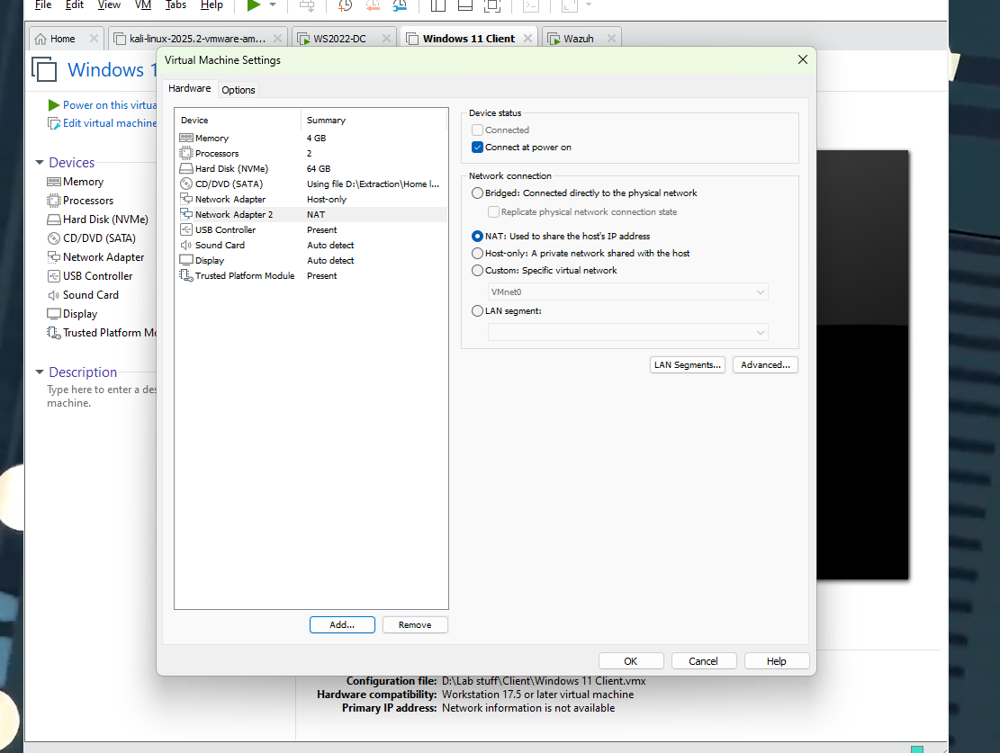
- Going to disable "Register this connection's addresses in DNS" in order to prevent future issues
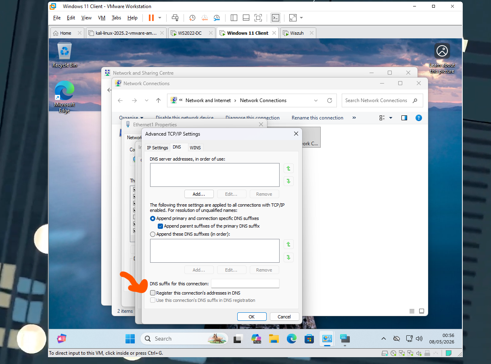
- Going to run ping commands again to double check I have internet connectivity:
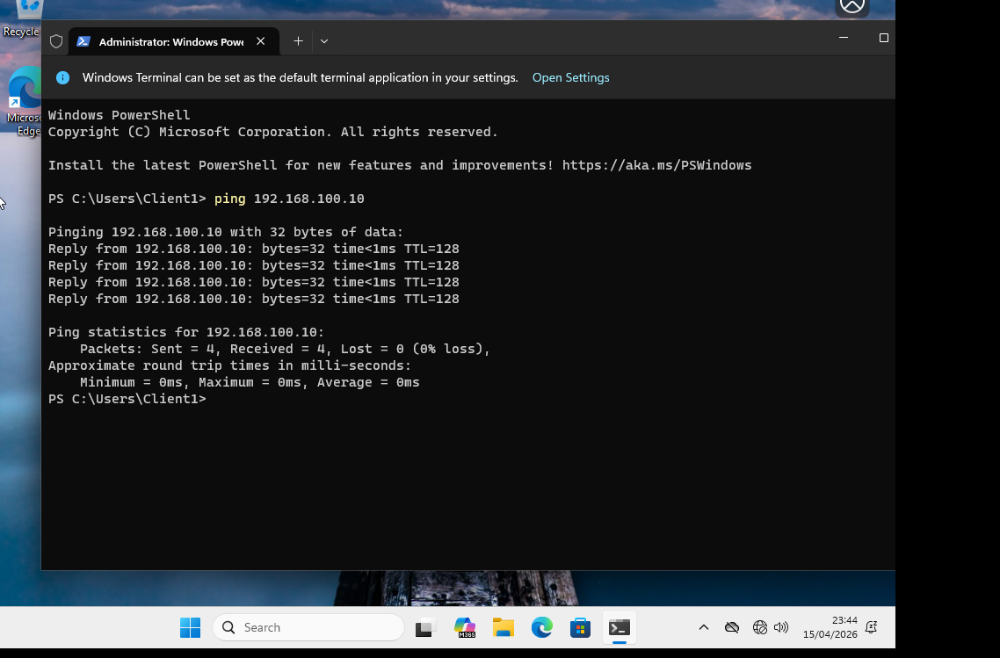
- So this shows that we do have internet connectivity, great 🥳.
- Now I am going to try running the install command again
  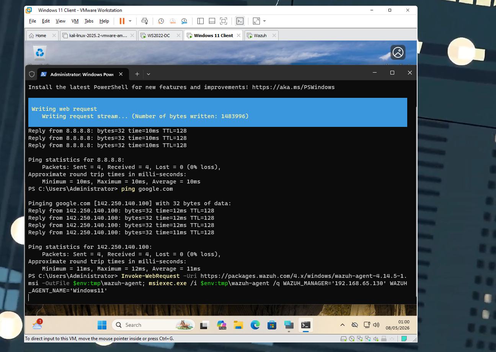
-Great it worked, problem solved ✅

#### Lessons Learnt:
- Double check outputs when a command fails
- How to install extra tools onto a VM such as copying and pasting

#### Tools used:
- Google
- VMware Workstation
- Wazuh

#### Back to installing the Agent
- Going to run the second command now and enable the agent.
- Successfully enabled the agent on the windows 11 VM
  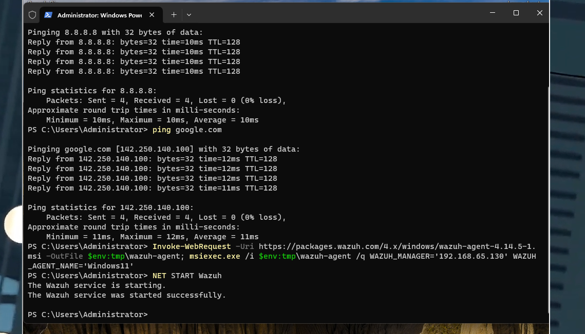
  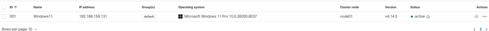

### Configuring failed logon alert
- Next I am going to configure an alert that alerts me if multiple failed logon attempts occur.
- 
  
